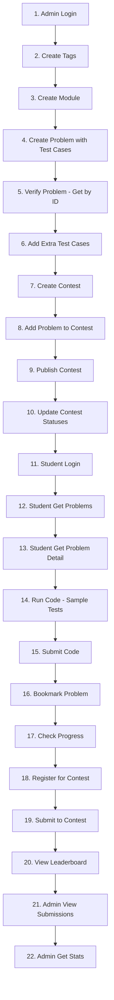

# Coding Platform API — Complete Postman Testing Guide

> **Base URL:** `http://localhost:5000`
> **Server Port:** `5000` (from `.env`)

---

## Tablecation Setup](#1-authentication-setup)
2. [Admin En of Contents

1. [Authentidpoints — Tags](#2-admin-endpoints--tags)
3. [Admin Endpoints — Modules](#3-admin-endpoints--modules)
4. [Admin Endpoints — Problems](#4-admin-endpoints--problems)
5. [Admin Endpoints — Test Cases](#5-admin-endpoints--test-cases)
6. [Admin Endpoints — Contests](#6-admin-endpoints--contests)
7. [Admin Endpoints — Contest Problems](#7-admin-endpoints--contest-problems)
8. [Admin Endpoints — Contest Status & Leaderboard](#8-admin-endpoints--contest-status--leaderboard)
9. [Admin Endpoints — Submissions](#9-admin-endpoints--submissions)
10. [Student Endpoints — Problems & Code Execution](#10-student-endpoints--problems--code-execution)
11. [Student Endpoints — Bookmarks](#11-student-endpoints--bookmarks)
12. [Student Endpoints — Progress & Submissions](#12-student-endpoints--progress--submissions)
13. [Student Endpoints — Contests](#13-student-endpoints--contests)
14. [Student Endpoints — Languages](#14-student-endpoints--languages)
15. [End-to-End Testing Flow](#15-end-to-end-testing-flow)

---

## 1. Authentication Setup

All coding platform endpoints require authentication. Admin endpoints need an admin JWT + signed cookie; student endpoints need a student JWT + signed cookie.

### 1A. Admin Login

| Field            | Value                          |
| ---------------- | ------------------------------ |
| **Method**       | `POST`                         |
| **URL**          | `{{base_url}}/api/admin/login` |
| **Content-Type** | `application/json`             |

**Body (JSON):**

```json
{
  "eid": "your_admin_eid",
  "password": "your_admin_password"
}
```

**What to do after login:**

1. Copy the `accessToken` from the response `data.accessToken`.
2. The server sets a signed cookie `adminRefreshToken` automatically — **Postman stores this in cookies**.

**Postman Setup for Admin Endpoints:**

- Go to the **Authorization** tab → Select `Bearer Token` → paste the `accessToken`.
- Ensure **cookies are enabled** in Postman settings (they are by default).

> [!IMPORTANT]
> Admin authentication requires **both** the Bearer token in the `Authorization` header AND the `adminRefreshToken` in a signed cookie. Postman handles cookies automatically after the login call.

### 1B. Student Login

| Field            | Value                            |
| ---------------- | -------------------------------- |
| **Method**       | `POST`                           |
| **URL**          | `{{base_url}}/api/student/login` |
| **Content-Type** | `application/json`               |

**Body (JSON):**

```json
{
  "email": "student@example.com",
  "password": "student_password"
}
```

Similarly, copy the `accessToken` and use it for student endpoints. The `studentRefreshToken` cookie is set automatically.

### Postman Environment Variables

Create a Postman Environment with these variables:

| Variable        | Value                                |
| --------------- | ------------------------------------ |
| `base_url`      | `http://localhost:5000`              |
| `ADMIN_TOKEN`   | _(paste after login)_                |
| `STUDENT_TOKEN` | _(paste after login)_                |
| `TAG_ID`        | _(saved after creating a tag)_       |
| `MODULE_ID`     | _(saved after creating a module)_    |
| `PROBLEM_ID`    | _(saved after creating a problem)_   |
| `TESTCASE_ID`   | _(saved after creating a test case)_ |
| `CONTEST_ID`    | _(saved after creating a contest)_   |
| `SUBMISSION_ID` | _(saved after submitting code)_      |

> [!TIP]
> Use Postman's **Tests** tab to auto-save IDs. Example script for the "Create Tag" response:
>
> ```javascript
> const json = pm.response.json();
> if (json.data && json.data.id) {
>   pm.environment.set("TAG_ID", json.data.id);
> }
> ```

---

## 2. Admin Endpoints — Tags

**Base Path:** `/api/coding-platform/tag`

### 2.1 Create Tag

| Field      | Value                                         |
| ---------- | --------------------------------------------- |
| **Method** | `POST`                                        |
| **URL**    | `{{base_url}}/api/coding-platform/tag/create` |
| **Auth**   | Bearer `{{ADMIN_TOKEN}}`                      |

```json
{
  "name": "Dynamic Programming",
  "description": "Problems involving dynamic programming techniques",
  "color": "#3B82F6"
}
```

**Expected Response (201):**

```json
{
  "success": true,
  "message": "Tag created successfully",
  "data": {
    "id": "clx...",
    "name": "Dynamic Programming",
    "slug": "dynamic-programming",
    "description": "Problems involving dynamic programming techniques",
    "color": "#3B82F6",
    "isActive": true
  }
}
```

> **Save** `data.id` as `{{TAG_ID}}`.

---

### 2.2 Get All Tags

| Field      | Value                                         |
| ---------- | --------------------------------------------- |
| **Method** | `GET`                                         |
| **URL**    | `{{base_url}}/api/coding-platform/tag/getall` |
| **Auth**   | Bearer `{{ADMIN_TOKEN}}`                      |

**Optional Query Params:**

| Param      | Example | Description             |
| ---------- | ------- | ----------------------- |
| `isActive` | `true`  | Filter by active status |

---

### 2.3 Get Tag by ID

| Field      | Value                                                 |
| ---------- | ----------------------------------------------------- |
| **Method** | `GET`                                                 |
| **URL**    | `{{base_url}}/api/coding-platform/tag/get/{{TAG_ID}}` |
| **Auth**   | Bearer `{{ADMIN_TOKEN}}`                              |

---

### 2.4 Update Tag

| Field      | Value                                                    |
| ---------- | -------------------------------------------------------- |
| **Method** | `PUT`                                                    |
| **URL**    | `{{base_url}}/api/coding-platform/tag/update/{{TAG_ID}}` |
| **Auth**   | Bearer `{{ADMIN_TOKEN}}`                                 |

```json
{
  "name": "DP & Memoization",
  "description": "Dynamic programming and memoization problems",
  "color": "#8B5CF6",
  "isActive": true
}
```

---

### 2.5 Delete Tag

| Field      | Value                                                    |
| ---------- | -------------------------------------------------------- |
| **Method** | `DELETE`                                                 |
| **URL**    | `{{base_url}}/api/coding-platform/tag/delete/{{TAG_ID}}` |
| **Auth**   | Bearer `{{ADMIN_TOKEN}}`                                 |

---

## 3. Admin Endpoints — Modules

**Base Path:** `/api/coding-platform/module`

### 3.1 Create Module

| Field      | Value                                            |
| ---------- | ------------------------------------------------ |
| **Method** | `POST`                                           |
| **URL**    | `{{base_url}}/api/coding-platform/module/create` |
| **Auth**   | Bearer `{{ADMIN_TOKEN}}`                         |

```json
{
  "name": "Arrays & Strings",
  "description": "Problems focusing on array and string manipulation",
  "order": 1
}
```

> **Save** `data.id` as `{{MODULE_ID}}`.

---

### 3.2 Get All Modules

| Field      | Value                                            |
| ---------- | ------------------------------------------------ |
| **Method** | `GET`                                            |
| **URL**    | `{{base_url}}/api/coding-platform/module/getall` |
| **Auth**   | Bearer `{{ADMIN_TOKEN}}`                         |

**Optional Query Params:** `isActive=true`

---

### 3.3 Get Module by ID

| Field      | Value                                                       |
| ---------- | ----------------------------------------------------------- |
| **Method** | `GET`                                                       |
| **URL**    | `{{base_url}}/api/coding-platform/module/get/{{MODULE_ID}}` |
| **Auth**   | Bearer `{{ADMIN_TOKEN}}`                                    |

---

### 3.4 Update Module

| Field      | Value                                                          |
| ---------- | -------------------------------------------------------------- |
| **Method** | `PUT`                                                          |
| **URL**    | `{{base_url}}/api/coding-platform/module/update/{{MODULE_ID}}` |
| **Auth**   | Bearer `{{ADMIN_TOKEN}}`                                       |

```json
{
  "name": "Arrays, Strings & Hashing",
  "description": "Comprehensive array, string, and hashing problems",
  "order": 1,
  "isActive": true
}
```

---

### 3.5 Delete Module

| Field      | Value                                                          |
| ---------- | -------------------------------------------------------------- |
| **Method** | `DELETE`                                                       |
| **URL**    | `{{base_url}}/api/coding-platform/module/delete/{{MODULE_ID}}` |
| **Auth**   | Bearer `{{ADMIN_TOKEN}}`                                       |

> [!NOTE]
> This performs a **soft delete** — sets `isActive` to `false`.

---

## 4. Admin Endpoints — Problems

**Base Path:** `/api/coding-platform/problem`

### 4.1 Create Problem (with test cases & tags)

| Field      | Value                                             |
| ---------- | ------------------------------------------------- |
| **Method** | `POST`                                            |
| **URL**    | `{{base_url}}/api/coding-platform/problem/create` |
| **Auth**   | Bearer `{{ADMIN_TOKEN}}`                          |

```json
{
  "title": "Two Sum",
  "description": "Given an array of integers `nums` and an integer `target`, return indices of the two numbers such that they add up to target.\n\nYou may assume that each input would have exactly one solution, and you may not use the same element twice.",
  "inputFormat": "First line: n (size of array)\nSecond line: n space-separated integers\nThird line: target integer",
  "outputFormat": "Two space-separated indices (0-indexed)",
  "constraints": "2 <= nums.length <= 10^4\n-10^9 <= nums[i] <= 10^9\n-10^9 <= target <= 10^9",
  "sampleInput": "4\n2 7 11 15\n9",
  "sampleOutput": "0 1",
  "explanation": "nums[0] + nums[1] = 2 + 7 = 9, so the answer is [0, 1].",
  "difficulty": "EASY",
  "timeLimit": 1000,
  "memoryLimit": 256,
  "starterCode": "function twoSum(nums, target) {\n  // Write your code here\n}",
  "solutionCode": "function twoSum(nums, target) {\n  const map = new Map();\n  for (let i = 0; i < nums.length; i++) {\n    const complement = target - nums[i];\n    if (map.has(complement)) {\n      return [map.get(complement), i];\n    }\n    map.set(nums[i], i);\n  }\n}",
  "hints": [
    "Try using a hash map",
    "What if you store each number's index as you iterate?"
  ],
  "moduleId": "{{MODULE_ID}}",
  "tagIds": ["{{TAG_ID}}"],
  "testCases": [
    {
      "input": "4\n2 7 11 15\n9",
      "output": "0 1",
      "isHidden": false,
      "isSample": true,
      "order": 0,
      "weight": 1
    },
    {
      "input": "3\n3 2 4\n6",
      "output": "1 2",
      "isHidden": false,
      "isSample": true,
      "order": 1,
      "weight": 1
    },
    {
      "input": "2\n3 3\n6",
      "output": "0 1",
      "isHidden": true,
      "isSample": false,
      "order": 2,
      "weight": 1
    },
    {
      "input": "5\n1 5 3 7 2\n8",
      "output": "1 2",
      "isHidden": true,
      "isSample": false,
      "order": 3,
      "weight": 2
    }
  ]
}
```

> **Save** `data.id` as `{{PROBLEM_ID}}`.

---

### 4.2 Get All Problems

| Field      | Value                                             |
| ---------- | ------------------------------------------------- |
| **Method** | `GET`                                             |
| **URL**    | `{{base_url}}/api/coding-platform/problem/getall` |
| **Auth**   | Bearer `{{ADMIN_TOKEN}}`                          |

**Optional Query Params:**

| Param        | Example         | Description                      |
| ------------ | --------------- | -------------------------------- |
| `difficulty` | `EASY`          | Filter: `EASY`, `MEDIUM`, `HARD` |
| `moduleId`   | `{{MODULE_ID}}` | Filter by module                 |
| `tagId`      | `{{TAG_ID}}`    | Filter by tag                    |
| `isActive`   | `true`          | Filter by active status          |
| `search`     | `two sum`       | Text search in title/description |
| `page`       | `1`             | Pagination                       |
| `limit`      | `20`            | Items per page                   |

---

### 4.3 Get Problem by ID

| Field      | Value                                                         |
| ---------- | ------------------------------------------------------------- |
| **Method** | `GET`                                                         |
| **URL**    | `{{base_url}}/api/coding-platform/problem/get/{{PROBLEM_ID}}` |
| **Auth**   | Bearer `{{ADMIN_TOKEN}}`                                      |

---

### 4.4 Update Problem

| Field      | Value                                                            |
| ---------- | ---------------------------------------------------------------- |
| **Method** | `PUT`                                                            |
| **URL**    | `{{base_url}}/api/coding-platform/problem/update/{{PROBLEM_ID}}` |
| **Auth**   | Bearer `{{ADMIN_TOKEN}}`                                         |

```json
{
  "title": "Two Sum (Updated)",
  "difficulty": "MEDIUM",
  "timeLimit": 2000,
  "hints": [
    "Try using a hash map",
    "Think about complement",
    "One-pass approach"
  ],
  "tagIds": ["{{TAG_ID}}"]
}
```

---

### 4.5 Delete Problem

| Field      | Value                                                            |
| ---------- | ---------------------------------------------------------------- |
| **Method** | `DELETE`                                                         |
| **URL**    | `{{base_url}}/api/coding-platform/problem/delete/{{PROBLEM_ID}}` |
| **Auth**   | Bearer `{{ADMIN_TOKEN}}`                                         |

---

### 4.6 Toggle Problem Active

| Field      | Value                                                                   |
| ---------- | ----------------------------------------------------------------------- |
| **Method** | `PATCH`                                                                 |
| **URL**    | `{{base_url}}/api/coding-platform/problem/{{PROBLEM_ID}}/toggle-active` |
| **Auth**   | Bearer `{{ADMIN_TOKEN}}`                                                |

_(No body required)_

---

## 5. Admin Endpoints — Test Cases

### 5.1 Add Single Test Case

| Field      | Value                                                              |
| ---------- | ------------------------------------------------------------------ |
| **Method** | `POST`                                                             |
| **URL**    | `{{base_url}}/api/coding-platform/problem/{{PROBLEM_ID}}/testcase` |
| **Auth**   | Bearer `{{ADMIN_TOKEN}}`                                           |

```json
{
  "input": "6\n1 3 5 7 9 2\n10",
  "output": "0 4",
  "isHidden": true,
  "isSample": false,
  "order": 4,
  "weight": 2
}
```

> **Save** `data.id` as `{{TESTCASE_ID}}`.

---

### 5.2 Bulk Add Test Cases

| Field      | Value                                                                    |
| ---------- | ------------------------------------------------------------------------ |
| **Method** | `POST`                                                                   |
| **URL**    | `{{base_url}}/api/coding-platform/problem/{{PROBLEM_ID}}/testcases/bulk` |
| **Auth**   | Bearer `{{ADMIN_TOKEN}}`                                                 |

```json
{
  "testCases": [
    {
      "input": "4\n-1 -2 -3 -4\n-6",
      "output": "1 3",
      "isHidden": true,
      "isSample": false,
      "order": 5,
      "weight": 1
    },
    {
      "input": "3\n0 4 3\n7",
      "output": "1 2",
      "isHidden": true,
      "isSample": false,
      "order": 6,
      "weight": 1
    }
  ]
}
```

---

### 5.3 Update Test Case

| Field      | Value                                                               |
| ---------- | ------------------------------------------------------------------- |
| **Method** | `PUT`                                                               |
| **URL**    | `{{base_url}}/api/coding-platform/problem/testcase/{{TESTCASE_ID}}` |
| **Auth**   | Bearer `{{ADMIN_TOKEN}}`                                            |

```json
{
  "input": "6\n1 3 5 7 9 2\n10",
  "output": "0 4",
  "isHidden": true,
  "isSample": false,
  "weight": 3
}
```

---

### 5.4 Delete Test Case

| Field      | Value                                                               |
| ---------- | ------------------------------------------------------------------- |
| **Method** | `DELETE`                                                            |
| **URL**    | `{{base_url}}/api/coding-platform/problem/testcase/{{TESTCASE_ID}}` |
| **Auth**   | Bearer `{{ADMIN_TOKEN}}`                                            |

---

## 6. Admin Endpoints — Contests

**Base Path:** `/api/coding-platform/contest`

### 6.1 Create Contest

| Field      | Value                                             |
| ---------- | ------------------------------------------------- |
| **Method** | `POST`                                            |
| **URL**    | `{{base_url}}/api/coding-platform/contest/create` |
| **Auth**   | Bearer `{{ADMIN_TOKEN}}`                          |

```json
{
  "title": "Weekly Coding Challenge #1",
  "description": "Solve 3 problems in 2 hours. Test your algorithmic skills!",
  "rules": "1. No plagiarism\n2. Each problem can be submitted multiple times\n3. Penalty time applies for wrong submissions",
  "visibility": "PUBLIC",
  "startTime": "2026-02-15T10:00:00.000Z",
  "endTime": "2026-02-15T12:00:00.000Z",
  "duration": 120,
  "maxAttempts": 10,
  "penaltyTime": 20,
  "showLeaderboard": true,
  "freezeTime": 15
}
```

> **Save** `data.id` as `{{CONTEST_ID}}`.

For a **private** contest:

```json
{
  "title": "Private Team Contest",
  "description": "Invitation-only coding challenge",
  "visibility": "PRIVATE",
  "accessCode": "SECRET2026",
  "startTime": "2026-02-20T14:00:00.000Z",
  "endTime": "2026-02-20T16:00:00.000Z",
  "duration": 120,
  "showLeaderboard": true
}
```

---

### 6.2 Get All Contests

| Field      | Value                                             |
| ---------- | ------------------------------------------------- |
| **Method** | `GET`                                             |
| **URL**    | `{{base_url}}/api/coding-platform/contest/getall` |
| **Auth**   | Bearer `{{ADMIN_TOKEN}}`                          |

**Optional Query Params:**

| Param        | Example  | Description                                       |
| ------------ | -------- | ------------------------------------------------- |
| `status`     | `DRAFT`  | Filter: `DRAFT`, `SCHEDULED`, `LIVE`, `COMPLETED` |
| `visibility` | `PUBLIC` | Filter: `PUBLIC`, `PRIVATE`                       |
| `isActive`   | `true`   | Filter by active status                           |
| `page`       | `1`      | Pagination                                        |
| `limit`      | `20`     | Items per page                                    |

---

### 6.3 Get Contest by ID

| Field      | Value                                                         |
| ---------- | ------------------------------------------------------------- |
| **Method** | `GET`                                                         |
| **URL**    | `{{base_url}}/api/coding-platform/contest/get/{{CONTEST_ID}}` |
| **Auth**   | Bearer `{{ADMIN_TOKEN}}`                                      |

---

### 6.4 Update Contest

| Field      | Value                                                            |
| ---------- | ---------------------------------------------------------------- |
| **Method** | `PUT`                                                            |
| **URL**    | `{{base_url}}/api/coding-platform/contest/update/{{CONTEST_ID}}` |
| **Auth**   | Bearer `{{ADMIN_TOKEN}}`                                         |

```json
{
  "title": "Weekly Coding Challenge #1 (Updated)",
  "description": "Solve 4 problems! Extended duration.",
  "duration": 150,
  "maxAttempts": 15
}
```

> [!WARNING]
> Cannot update contests in `LIVE` or `COMPLETED` status.

---

### 6.5 Delete Contest

| Field      | Value                                                            |
| ---------- | ---------------------------------------------------------------- |
| **Method** | `DELETE`                                                         |
| **URL**    | `{{base_url}}/api/coding-platform/contest/delete/{{CONTEST_ID}}` |
| **Auth**   | Bearer `{{ADMIN_TOKEN}}`                                         |

> [!CAUTION]
> Only contests in `DRAFT` status can be deleted.

---

## 7. Admin Endpoints — Contest Problems

### 7.1 Add Problem to Contest

| Field      | Value                                                                 |
| ---------- | --------------------------------------------------------------------- |
| **Method** | `POST`                                                                |
| **URL**    | `{{base_url}}/api/coding-platform/contest/{{CONTEST_ID}}/add-problem` |
| **Auth**   | Bearer `{{ADMIN_TOKEN}}`                                              |

```json
{
  "problemId": "{{PROBLEM_ID}}",
  "points": 100,
  "label": "A"
}
```

---

### 7.2 Remove Problem from Contest

| Field      | Value                                                                                   |
| ---------- | --------------------------------------------------------------------------------------- |
| **Method** | `DELETE`                                                                                |
| **URL**    | `{{base_url}}/api/coding-platform/contest/{{CONTEST_ID}}/remove-problem/{{PROBLEM_ID}}` |
| **Auth**   | Bearer `{{ADMIN_TOKEN}}`                                                                |

---

### 7.3 Reorder Contest Problems

| Field      | Value                                                                      |
| ---------- | -------------------------------------------------------------------------- |
| **Method** | `PUT`                                                                      |
| **URL**    | `{{base_url}}/api/coding-platform/contest/{{CONTEST_ID}}/reorder-problems` |
| **Auth**   | Bearer `{{ADMIN_TOKEN}}`                                                   |

```json
{
  "problemOrders": [
    { "problemId": "{{PROBLEM_ID}}", "order": 0, "label": "A" },
    { "problemId": "<another_problem_id>", "order": 1, "label": "B" }
  ]
}
```

---

## 8. Admin Endpoints — Contest Status & Leaderboard

### 8.1 Publish Contest (DRAFT → SCHEDULED)

| Field      | Value                                                             |
| ---------- | ----------------------------------------------------------------- |
| **Method** | `PATCH`                                                           |
| **URL**    | `{{base_url}}/api/coding-platform/contest/{{CONTEST_ID}}/publish` |
| **Auth**   | Bearer `{{ADMIN_TOKEN}}`                                          |

_(No body required)_ — Contest must have at least 1 problem.

---

### 8.2 Update Contest Statuses (SCHEDULED→LIVE, LIVE→COMPLETED)

| Field      | Value                                                      |
| ---------- | ---------------------------------------------------------- |
| **Method** | `POST`                                                     |
| **URL**    | `{{base_url}}/api/coding-platform/contest/update-statuses` |
| **Auth**   | Bearer `{{ADMIN_TOKEN}}`                                   |

_(No body required)_ — Automatically transitions contests based on current time.

---

### 8.3 Get Contest Leaderboard

| Field      | Value                                                                 |
| ---------- | --------------------------------------------------------------------- |
| **Method** | `GET`                                                                 |
| **URL**    | `{{base_url}}/api/coding-platform/contest/{{CONTEST_ID}}/leaderboard` |
| **Auth**   | Bearer `{{ADMIN_TOKEN}}`                                              |

**Optional Query Params:** `page=1`, `limit=50`

---

### 8.4 Get Contest Submissions (Admin)

| Field      | Value                                                                 |
| ---------- | --------------------------------------------------------------------- |
| **Method** | `GET`                                                                 |
| **URL**    | `{{base_url}}/api/coding-platform/contest/{{CONTEST_ID}}/submissions` |
| **Auth**   | Bearer `{{ADMIN_TOKEN}}`                                              |

**Optional Query Params:** `page=1`, `limit=50`

---

## 9. Admin Endpoints — Submissions

**Base Path:** `/api/coding-platform/submissions`

### 9.1 Get All Submissions

| Field      | Value                                          |
| ---------- | ---------------------------------------------- |
| **Method** | `GET`                                          |
| **URL**    | `{{base_url}}/api/coding-platform/submissions` |
| **Auth**   | Bearer `{{ADMIN_TOKEN}}`                       |

**Optional Query Params:**

| Param       | Example          | Description                                                                                     |
| ----------- | ---------------- | ----------------------------------------------------------------------------------------------- |
| `studentId` | `student_uuid`   | Filter by student                                                                               |
| `problemId` | `{{PROBLEM_ID}}` | Filter by problem                                                                               |
| `status`    | `ACCEPTED`       | Filter: `ACCEPTED`, `WRONG_ANSWER`, `TIME_LIMIT_EXCEEDED`, `RUNTIME_ERROR`, `COMPILATION_ERROR` |
| `page`      | `1`              | Pagination                                                                                      |
| `limit`     | `50`             | Items per page                                                                                  |

---

### 9.2 Get Submission Stats

| Field      | Value                                                |
| ---------- | ---------------------------------------------------- |
| **Method** | `GET`                                                |
| **URL**    | `{{base_url}}/api/coding-platform/submissions/stats` |
| **Auth**   | Bearer `{{ADMIN_TOKEN}}`                             |

**Optional Query Params:** `problemId={{PROBLEM_ID}}`, `contestId={{CONTEST_ID}}`

---

### 9.3 Get Submission by ID

| Field      | Value                                                            |
| ---------- | ---------------------------------------------------------------- |
| **Method** | `GET`                                                            |
| **URL**    | `{{base_url}}/api/coding-platform/submissions/{{SUBMISSION_ID}}` |
| **Auth**   | Bearer `{{ADMIN_TOKEN}}`                                         |

---

### 9.4 Delete Submission

| Field      | Value                                                            |
| ---------- | ---------------------------------------------------------------- |
| **Method** | `DELETE`                                                         |
| **URL**    | `{{base_url}}/api/coding-platform/submissions/{{SUBMISSION_ID}}` |
| **Auth**   | Bearer `{{ADMIN_TOKEN}}`                                         |

---

## 10. Student Endpoints — Problems & Code Execution

**Base Path:** `/api/student/coding`

### 10.1 Get All Problems (Student View)

| Field      | Value                                      |
| ---------- | ------------------------------------------ |
| **Method** | `GET`                                      |
| **URL**    | `{{base_url}}/api/student/coding/problems` |
| **Auth**   | Bearer `{{STUDENT_TOKEN}}`                 |

**Optional Query Params:**

| Param        | Example         | Description                       |
| ------------ | --------------- | --------------------------------- |
| `difficulty` | `EASY`          | `EASY`, `MEDIUM`, `HARD`          |
| `moduleId`   | `{{MODULE_ID}}` | Filter by module                  |
| `tagId`      | `{{TAG_ID}}`    | Filter by tag                     |
| `status`     | `UNSOLVED`      | `UNSOLVED`, `ATTEMPTED`, `SOLVED` |
| `search`     | `two sum`       | Text search                       |
| `page`       | `1`             | Pagination                        |
| `limit`      | `20`            | Items per page                    |

---

### 10.2 Get Problem by ID (Student View)

| Field      | Value                                                     |
| ---------- | --------------------------------------------------------- |
| **Method** | `GET`                                                     |
| **URL**    | `{{base_url}}/api/student/coding/problems/{{PROBLEM_ID}}` |
| **Auth**   | Bearer `{{STUDENT_TOKEN}}`                                |

> Only shows **sample** test cases (hidden test cases are excluded).

---

### 10.3 Run Code (Sample Test Cases)

| Field      | Value                                                         |
| ---------- | ------------------------------------------------------------- |
| **Method** | `POST`                                                        |
| **URL**    | `{{base_url}}/api/student/coding/problems/{{PROBLEM_ID}}/run` |
| **Auth**   | Bearer `{{STUDENT_TOKEN}}`                                    |

**With sample test cases:**

```json
{
  "code": "function twoSum(nums, target) {\n  const map = new Map();\n  for (let i = 0; i < nums.length; i++) {\n    const complement = target - nums[i];\n    if (map.has(complement)) return map.get(complement) + ' ' + i;\n    map.set(nums[i], i);\n  }\n}\nconst readline = require('readline');\nconst rl = readline.createInterface({ input: process.stdin });\nconst lines = [];\nrl.on('line', l => lines.push(l));\nrl.on('close', () => {\n  const n = parseInt(lines[0]);\n  const nums = lines[1].split(' ').map(Number);\n  const target = parseInt(lines[2]);\n  console.log(twoSum(nums, target));\n});",
  "language": "javascript"
}
```

**With custom input:**

```json
{
  "code": "<same code as above>",
  "language": "javascript",
  "customInput": "4\n2 7 11 15\n9"
}
```

**Supported languages:** `javascript`, `python`, `java`, `c`, `cpp`, `go`, `rust`, `ruby`, `php`, `swift`, `kotlin`, `scala`, `csharp` (`c#`)

---

### 10.4 Submit Code (All Test Cases)

| Field      | Value                                                            |
| ---------- | ---------------------------------------------------------------- |
| **Method** | `POST`                                                           |
| **URL**    | `{{base_url}}/api/student/coding/problems/{{PROBLEM_ID}}/submit` |
| **Auth**   | Bearer `{{STUDENT_TOKEN}}`                                       |

**Regular submission:**

```json
{
  "code": "<your solution code>",
  "language": "python"
}
```

**Python example:**

```json
{
  "code": "n = int(input())\nnums = list(map(int, input().split()))\ntarget = int(input())\nd = {}\nfor i, num in enumerate(nums):\n    comp = target - num\n    if comp in d:\n        print(d[comp], i)\n        break\n    d[num] = i",
  "language": "python"
}
```

**Contest submission (include contestId):**

```json
{
  "code": "<your solution code>",
  "language": "python",
  "contestId": "{{CONTEST_ID}}"
}
```

> **Save** `data.submissionId` as `{{SUBMISSION_ID}}` from the response.

---

## 11. Student Endpoints — Bookmarks

### 11.1 Add Bookmark

| Field      | Value                                                      |
| ---------- | ---------------------------------------------------------- |
| **Method** | `POST`                                                     |
| **URL**    | `{{base_url}}/api/student/coding/bookmarks/{{PROBLEM_ID}}` |
| **Auth**   | Bearer `{{STUDENT_TOKEN}}`                                 |

_(No body required)_

---

### 11.2 Remove Bookmark

| Field      | Value                                                      |
| ---------- | ---------------------------------------------------------- |
| **Method** | `DELETE`                                                   |
| **URL**    | `{{base_url}}/api/student/coding/bookmarks/{{PROBLEM_ID}}` |
| **Auth**   | Bearer `{{STUDENT_TOKEN}}`                                 |

---

### 11.3 Get All Bookmarks

| Field      | Value                                       |
| ---------- | ------------------------------------------- |
| **Method** | `GET`                                       |
| **URL**    | `{{base_url}}/api/student/coding/bookmarks` |
| **Auth**   | Bearer `{{STUDENT_TOKEN}}`                  |

**Optional Query Params:** `page=1`, `limit=20`

---

## 12. Student Endpoints — Progress & Submissions

### 12.1 Get My Progress

| Field      | Value                                         |
| ---------- | --------------------------------------------- |
| **Method** | `GET`                                         |
| **URL**    | `{{base_url}}/api/student/coding/my-progress` |
| **Auth**   | Bearer `{{STUDENT_TOKEN}}`                    |

---

### 12.2 Get My Submissions

| Field      | Value                                            |
| ---------- | ------------------------------------------------ |
| **Method** | `GET`                                            |
| **URL**    | `{{base_url}}/api/student/coding/my-submissions` |
| **Auth**   | Bearer `{{STUDENT_TOKEN}}`                       |

**Optional Query Params:** `problemId={{PROBLEM_ID}}`, `status=ACCEPTED`, `page=1`, `limit=20`

---

### 12.3 Get Submission by ID

| Field      | Value                                                              |
| ---------- | ------------------------------------------------------------------ |
| **Method** | `GET`                                                              |
| **URL**    | `{{base_url}}/api/student/coding/my-submissions/{{SUBMISSION_ID}}` |
| **Auth**   | Bearer `{{STUDENT_TOKEN}}`                                         |

---

## 13. Student Endpoints — Contests

### 13.1 Get All Contests

| Field      | Value                                      |
| ---------- | ------------------------------------------ |
| **Method** | `GET`                                      |
| **URL**    | `{{base_url}}/api/student/coding/contests` |
| **Auth**   | Bearer `{{STUDENT_TOKEN}}`                 |

**Optional Query Params:** `status=LIVE`, `page=1`, `limit=20`

---

### 13.2 Get Active Contests

| Field      | Value                                             |
| ---------- | ------------------------------------------------- |
| **Method** | `GET`                                             |
| **URL**    | `{{base_url}}/api/student/coding/contests/active` |
| **Auth**   | Bearer `{{STUDENT_TOKEN}}`                        |

---

### 13.3 Get Contest by ID

| Field      | Value                                                     |
| ---------- | --------------------------------------------------------- |
| **Method** | `GET`                                                     |
| **URL**    | `{{base_url}}/api/student/coding/contests/{{CONTEST_ID}}` |
| **Auth**   | Bearer `{{STUDENT_TOKEN}}`                                |

---

### 13.4 Register for Contest

| Field      | Value                                                              |
| ---------- | ------------------------------------------------------------------ |
| **Method** | `POST`                                                             |
| **URL**    | `{{base_url}}/api/student/coding/contests/{{CONTEST_ID}}/register` |
| **Auth**   | Bearer `{{STUDENT_TOKEN}}`                                         |

_(No body required)_

---

### 13.5 Get Contest Leaderboard (Student)

| Field      | Value                                                                 |
| ---------- | --------------------------------------------------------------------- |
| **Method** | `GET`                                                                 |
| **URL**    | `{{base_url}}/api/student/coding/contests/{{CONTEST_ID}}/leaderboard` |
| **Auth**   | Bearer `{{STUDENT_TOKEN}}`                                            |

---

### 13.6 Get My Contests

| Field      | Value                                         |
| ---------- | --------------------------------------------- |
| **Method** | `GET`                                         |
| **URL**    | `{{base_url}}/api/student/coding/my-contests` |
| **Auth**   | Bearer `{{STUDENT_TOKEN}}`                    |

---

## 14. Student Endpoints — Languages

### 14.1 Get Supported Languages

| Field      | Value                                       |
| ---------- | ------------------------------------------- |
| **Method** | `GET`                                       |
| **URL**    | `{{base_url}}/api/student/coding/languages` |
| **Auth**   | Bearer `{{STUDENT_TOKEN}}`                  |

---

## 15. End-to-End Testing Flow

Follow this ordered sequence to test the entire platform end-to-end:



### Step-by-step:

| Step | Action                                    | Endpoint                                                          |
| ---- | ----------------------------------------- | ----------------------------------------------------------------- |
| 1    | Admin Login                               | `POST /api/admin/login`                                           |
| 2    | Create 2–3 Tags                           | `POST /api/coding-platform/tag/create`                            |
| 3    | Create a Module                           | `POST /api/coding-platform/module/create`                         |
| 4    | Create a Problem (with tags + test cases) | `POST /api/coding-platform/problem/create`                        |
| 5    | Verify the problem                        | `GET /api/coding-platform/problem/get/:id`                        |
| 6    | Add more test cases (bulk)                | `POST /api/coding-platform/problem/:id/testcases/bulk`            |
| 7    | Create a Contest                          | `POST /api/coding-platform/contest/create`                        |
| 8    | Add the problem to the contest            | `POST /api/coding-platform/contest/:id/add-problem`               |
| 9    | Publish the contest                       | `PATCH /api/coding-platform/contest/:id/publish`                  |
| 10   | Update contest statuses                   | `POST /api/coding-platform/contest/update-statuses`               |
| 11   | Student Login                             | `POST /api/student/login`                                         |
| 12   | Browse problems                           | `GET /api/student/coding/problems`                                |
| 13   | View problem details                      | `GET /api/student/coding/problems/:id`                            |
| 14   | Run code against samples                  | `POST /api/student/coding/problems/:id/run`                       |
| 15   | Submit solution                           | `POST /api/student/coding/problems/:id/submit`                    |
| 16   | Bookmark the problem                      | `POST /api/student/coding/bookmarks/:id`                          |
| 17   | Check progress                            | `GET /api/student/coding/my-progress`                             |
| 18   | Register for contest                      | `POST /api/student/coding/contests/:id/register`                  |
| 19   | Submit in contest                         | `POST /api/student/coding/problems/:id/submit` (with `contestId`) |
| 20   | View leaderboard                          | `GET /api/student/coding/contests/:id/leaderboard`                |
| 21   | Admin: View all submissions               | `GET /api/coding-platform/submissions`                            |
| 22   | Admin: Get stats                          | `GET /api/coding-platform/submissions/stats`                      |

> [!TIP]
> To auto-chain these in Postman, create a **Collection** and use the **Collection Runner**. Add Test scripts to each request to store IDs in environment variables.
